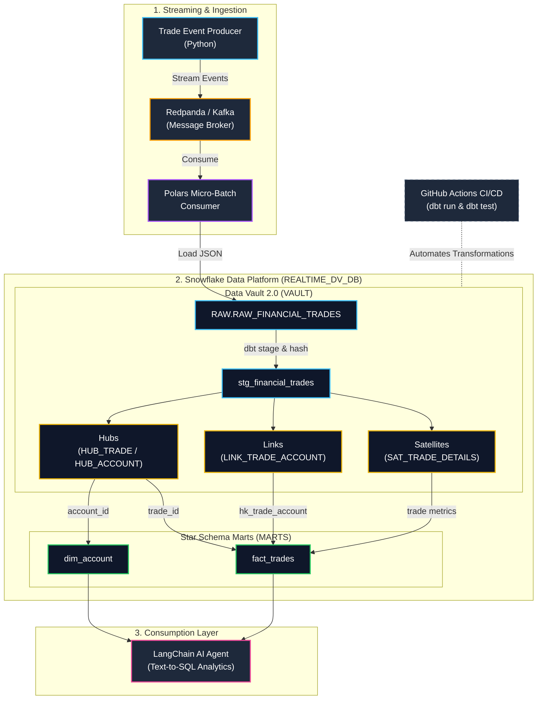

# Real-Time Financial Data Vault & AI Query Engine

An enterprise-grade, end-to-end real-time data engineering pipeline built with **Kafka (Redpanda)**, **Python (Polars)**, **Snowflake**, **dbt**, **GitHub Actions CI/CD**, and **LangChain**.

## Architecture Overview



## Key Components

1. **Event Streaming**: Python producer emitting streaming stock trade events to a Redpanda (Kafka) topic.
2. **High-Throughput Ingestion**: Python + Polars micro-batch consumer writing JSON payloads to Snowflake (`RAW.RAW_FINANCIAL_TRADES`).
3. **Data Vault 2.0 Modeling**: `dbt-snowflake` incremental models building deterministic MD5 Hash Keys across:
   - **Hubs**: `HUB_TRADE`, `HUB_ACCOUNT`
   - **Links**: `LINK_TRADE_ACCOUNT`
   - **Satellites**: `SAT_TRADE_DETAILS`
4. **Dimensional Information Marts**: Star Schema modeling producing `dim_account` and `fact_trades` for high-performance analytical queries.
5. **Continuous Integration (CI/CD)**: Automated GitHub Actions workflow testing connection health (`dbt debug`), executing transformations (`dbt run`), and running quality assertions (`dbt test`).
6. **AI Integration**: LangChain Text-to-SQL agent enabling natural language queries directly over the Snowflake Star Schema.

## How to Run

### 1. Ingestion Pipeline
```bash
# Start Redpanda Broker
docker compose -f docker/docker-compose.yml up -d

# Start Ingestion Consumer
python consumers/snowflake_stream_consumer.py
```

### 2. dbt Transformations

```Bash
cd transform
dbt run
dbt test
```

### 3. AI Agent Interface

```Bash
python scripts/ai_sql_agent.py
```

