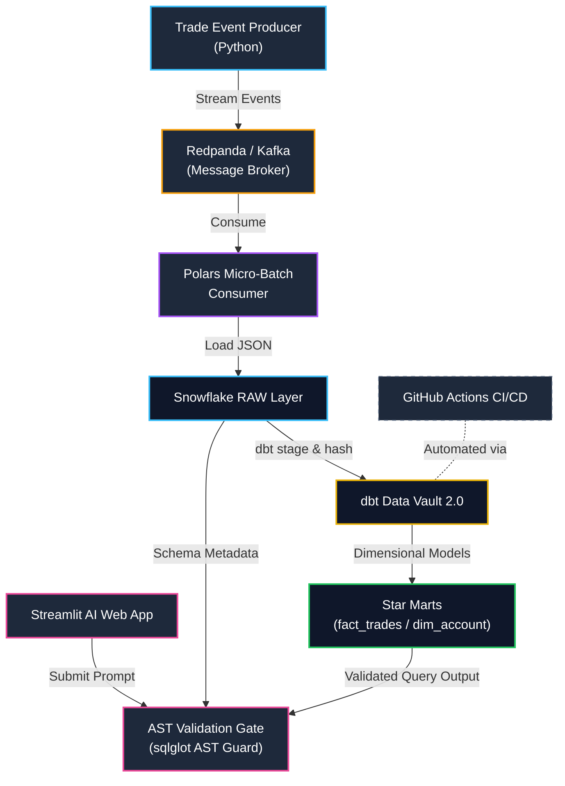

# Real-Time Financial Data Vault 2.0 & AST-Guarded AI Analytics Engine

An enterprise-grade, end-to-end real-time financial data platform built with **Redpanda (Kafka)**, **Python (Polars)**, **Snowflake**, **dbt Data Vault 2.0**, **GitHub Actions CI/CD**, **LangChain**, and **sqlglot AST Validation**.

---

## 🏗️ Architecture Overview


---

## 🔑 Key Features & Pipeline Phases

### 1. Real-Time Streaming & High-Throughput Ingestion
* **Message Broker**: Synthetic financial trade producer emitting JSON streams to Redpanda (Kafka).
* **Polars Micro-Batch Consumer**: Micro-batching consumer writing payloads directly into Snowflake landing tables (`RAW.RAW_FINANCIAL_TRADES`).

### 2. Data Vault 2.0 & Information Marts (dbt + Snowflake)
* **Deterministic Hashing**: `dbt-snowflake` incremental models generating MD5 hash keys (`hk_trade_id`, `hk_account_id`) across Hubs, Links, and Satellites without sequence lockups.
* **Dimensional Marts**: High-performance Star Schema layer (`dim_account`, `fact_trades`) decoupling raw auditability from consumer analytics.

### 3. Production DevOps & Quality Assurance
* **Automated CI/CD**: GitHub Actions workflow executing `dbt debug`, `dbt run`, and `dbt test` assertions automatically on pull requests using repository secrets.

### 4. AI Integration & AST Safety Audit Gate
* **Text-to-SQL Agent**: LangChain agent translating natural language analytical prompts into valid Snowflake SQL.
* **3-Tier AST Safety Gate (`sqlglot`)**: Static AST parsing intercepting queries before execution to enforce:
  * Rejection of DDL/DML mutations (`DROP`, `DELETE`, `UPDATE`, `ALTER`, `TRUNCATE`).
  * Schema access control restricting queries to `STAGING_MARTS`.
  * Automatic `LIMIT` injection for query cost governance.

---

## 📁 Repository Structure

```text
realtime-data-vault-engine/
├── consumers/                       # High-throughput Polars streaming consumers
│   └── snowflake_stream_consumer.py
├── docker/                          # Container orchestration (Redpanda / Kafka)
│   └── docker-compose.yml
├── .github/workflows/               # CI/CD workflows
│   └── dbt_ci.yml
├── scripts/                         # Operational & AI scripts
│   ├── ai_sql_agent.py              # CLI Text-to-SQL agent
│   ├── sql_validator.py             # sqlglot AST security parser
│   └── app.py                       # Streamlit web interface
├── transform/                       # Complete dbt Data Vault & Marts project
│   ├── models/
│   │   ├── staging/
│   │   ├── vault/
│   │   └── marts/
│   └── dbt_project.yml
└── README.md
```

## Configuration

Create a `.env` file in the project root with the credentials required by the Snowflake consumer and AI analytics app:

```dotenv
SNOWFLAKE_ACCOUNT=<your-snowflake-account>
SNOWFLAKE_USER=<your-snowflake-user>
SNOWFLAKE_PASSWORD=<your-snowflake-password>
SNOWFLAKE_WAREHOUSE=REALTIME_DV_WH
SNOWFLAKE_DATABASE=REALTIME_DV_DB
SNOWFLAKE_SCHEMA=STAGING_MARTS
OPENAI_API_KEY=<your-openai-api-key>
```

Keep `.env` out of version control and use secret storage for deployed environments.

## 🚀 Quickstart Guide

### 1. Prerequisites & Environment Setup

```bash
# Clone Repository
git clone [https://github.com/vrrgithub1/realtime-data-vault-engine.git](https://github.com/vrrgithub1/realtime-data-vault-engine.git)
cd realtime-data-vault-engine

# Activate Conda Environment & Install Dependencies
conda activate realtime-vault-u
pip install -r requirements.txt
```

### 2. Launch Ingestion Pipeline

```Bash
# Start Redpanda Broker
docker compose -f docker/docker-compose.yml up -d

# Run Micro-Batch Consumer
python consumers/snowflake_stream_consumer.py
```

### 3. Execute dbt Transformations

```Bash
cd transform
dbt run
dbt test
```

### 4. Launch AI Web Interface with AST Guardrails

```Bash
cd scripts
streamlit run app.py
```

## Medium Publication

[From Streaming Trade Data to AI-Powered Analytics: An End-to-End Data Vault 2.0 Architecture](https://medium.com/@vrrajadurai/from-streaming-trade-data-to-ai-powered-analytics-an-end-to-end-data-vault-2-0-architecture-f906d952674f?sharedUserId=vrrajadurai)
